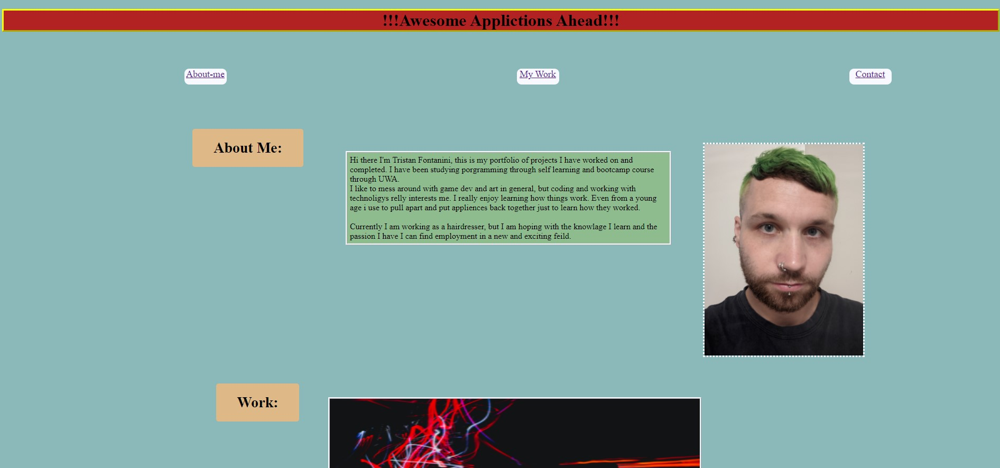
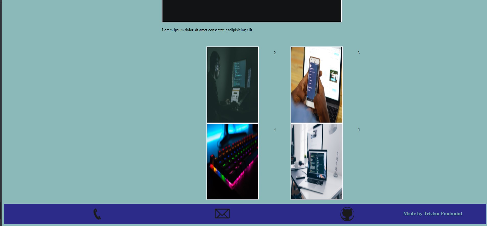

<h1> 02 - Advanced CSS Portfolio </h1>
UWA Web Dev Bootcamp - feb 2021

<p>[Github Repo] https://github.com/Twistedmouse/Professional_Portfolio-homework <br>
[Depolyed URL] https://twistedmouse.github.io/Professional_Portfolio-homework/ </p>
-------------------------------------------------------
<p>INTRO: so for this project i tried to follow acceptance crieria as close as possible but also playing with code and testing how far i can push positioning. I learnt alot in the project of what i can do and what not to do/what shouldnt really be done on a webpage.</p>
## The Task:
<p> to create a portfolio webpage to display our work on</p>
<br>

---

## Screenshots and Decription:
First step was to create a stucture with html. being my first page i have made from scratch i really wanted to see what i could push and play with. so I went for a more free flow layout.<br>
I thought mostly using realative postioning would be a good idea to move objects exactly where I wanted. i later learnt that more free flow layouts can look rather messy and are alot harder to resize with media quries. (mostly because I then had reposition every element indovidually i thought just changing the viewport width would be the solution but boy was I wrong.<br>
<p> once I had my basic structure:</p>

<!DOCTYPE html>
<html lang="en">
<head>
    <meta charset="UTF-8">
    <meta http-equiv="X-UA-Compatible" content="IE=edge">
    <meta name="viewport" content="width=device-width, initial-scale=1.0">
    <title>Professional Portfolio</title>
</head>

<body>
    
    <header>
        <!-- main header -->
        <h1>~`.Tristan Fontanini Personal Portfolio.`~</h1>
        
    </header>
 
            <!-- navbar -->
     <nav id="links">
            
    </nav>
    
    <!-- about me section of page. -->
    <main>
        <h2 id="about-me">About Me:</h2>
        <article>
          
        </article>
    </main>
<!-- work section of the page -->
    <section class="app-ls">
        <h2 id="work">Work:</h2>
        <ul>
            <li>
                <!-- my larger image that links to project -->
                <figure id="largeImage">
                  
                    <!-- the other projects in a neat grid -->
                </figure>
                <figure class="container">
                
                    </figure>
            </li>
        </ul>
    
    </section>
<!-- footer with contact section of the page in the form of icons  -->
    <footer id="contact">
       
    </footer>
</body>
</html>


<p>I then moved onto my CSS to work out the layout of my page. I made a very basic design with gross loud colors and some intersting imgaes as place holders:<br></p> 




As my CSS got longer i split it into 3 style sheets for easier readabillity:<br>
<p>style1 was for my top part of page my header and navbar<br>
style2 was for my main section with my about me and photo of myself.<br>
style3 was for my work section with my app images and then followed by the footer of the page.<br>
</p>


<p>once I was happy with my CSS I changed all my placeholders to make the page abit more exciting: </p>


I was happy with my layout at this time but started thinking that the resizing of the page my break it but i thought it was fine.(it was not fine.)<br>
I felt like I already did to much work to start again so I stuck to my plan.<br>
I then thought it would be a good idea to add some intersting effects with some pseudo class's<br>
I made my contact icons invert color when hoverd over 
```
footer img:hover{
    filter: invert(1);
}
```


<p>I also wanted to make a hamburger drop menu for my nav this was alot more difficault then I thought but I was really proud of my resault and I was happy with how easy it was the scroll to each part of the page.</p>


```
/* links and link li are my navbar under the header */
#links{
    position: fixed;
    display: flex;
    z-index: 999;
    justify-content: flex-end;
    width: 100%;
    text-align: center;
    margin: 70px;
}
/* the look of the nav bar */
#links li{
    display: none;
    position: relative;
    left: 200px;
    z-index: 999;
    background-color: #8d00ff;
    width: 110px;
    height: 60px;
    border-bottom-left-radius: 5px;
    font-size: 18px;
    font-weight: bolder;
    margin-right: 150px;
    margin-top: -190px;
    margin-left: -8.5em;
    
}

#links li a{
    position: relative;
    z-index: 999;
    top: 13px;
    color: rgb(25, 41, 41);
}

#links li a:hover{
    color: ghostwhite;
}

.navToggle:checked ~ #links li {
    display: inline-block;
}

.navToggle{
    display: none;
    z-index: 1000;
    position: fixed;
    float: right;
    bottom: 170px;
    right: 130px;
    height: 50px;
    width: 50px;
}

/* the middle of my hamburger also linked to the checkbox parent */
.navToggle-lable span{
    z-index: 999;
    position: fixed;
    bottom: 923px;
    right: 275px;
    color: ghostwhite;
    font-weight: bolder;
    font-family: fantasy;
}
.navToggle-lable:hover{
    color: ghostwhite;
}
 
/* the two extra lines that make my hamburger menu */
.navToggle-lable span::before,
.navToggle-lable span::after {
    display: block;
    background-color: ghostwhite;
    height: 2px;
    width: 2em;
    border-radius: 2px;
    position: fixed;
    content: '';   
}

.navToggle-lable span:hover{
    filter: drop-shadow(2px 4px 8px);
}

.navToggle-lable span:active{
    transform: rotate(45deg)
}
```
<p>Next was linking my project images:</p>

 
Then I added a hover effect:
```
#largeImage img:hover{
    opacity: 80%;
    box-shadow: 0px 10px 15px ghostwhite;
}
```

```
.container img:hover{
    opacity: 80%;
    box-shadow: 0px 10px 15px ghostwhite;
}

```


<p> and clicking this link will link to a new page. </p>

<p> Once all the style elements were done it was time to work on the media queries </p>
I found working woth the media queries at first it was simple and all made sence. but as I tried scaling smaller and smaller i noticed it would break very easy I beleive this is due to all the different postion elements i was using or more the relative poistioning I was using for most my elements.<br>


my first media querie worked very well it was responsive and neat. but because i had to move everything indavidually it made this part very time consumming and moving some elments moved others so there became alot of back and forth. <br>
<p> Even my navbar was being responsive.</p>


<p> And even on the smaller scale for mobile it was being responsive. But then i saved came back later on and i had this huge open space. I beleive its the postioning of my main section but changing it seems to mess up the layout alot I was running out of time so i thought at this time ill have to accept this issue and learn from it.</p>


<p> Overall I am very happy with the style of my page and I'v learnt alot from the project.</p>

---

## Things i would do differently 

<ul>
    <ls>First of all i would change the layout of my page. to me my layout looks abit messy and not very proffetional now. <br> </ls>
    <ls> <br>next time around i would use more flex elements it would make it easyer to rescale in the long run and having more of a grid layout to a page will help with responsivness. <br></ls>
    <ls><br> I would use my time better next time around too. the navbar took me far longer then i thought and having so many elements to make it made it hard too rescale and made the responsiveness rather hard. I'v already got an idea to use less relative postioning as well.<br>  </ls>
</ul>